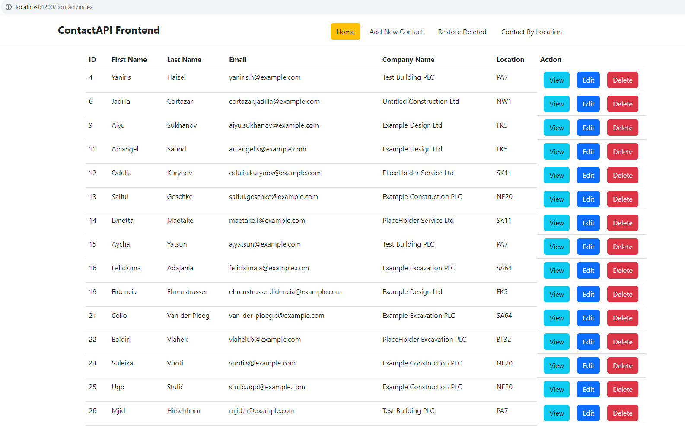

# APICONTACT ANGULAR FRONTEND for  MGF PHP API BACKEND

## SETUP REQUIREMENTS - Install the follow;
* Node Js LTS 18.* 
* NPM 9.8.1
* Angular CLI 16.2.* 

## DEPLOYMENT STEP 1

* Ensure that your have setup the backend api which is *** MGF PHP API BACKEND *** reference the readme file for the install of requirement for the backend.

* Then download or PULL the the folder " apicontact " to you local system 

## DEPLOYMENT STEP 2 - Navigate to apicontact folder root

* CMD to the folder " apicontact " root at command prompt. ***C:\~\apicontact>***

## DEPLOYMENT STEP 3 - Then RUN the following commands

***Ensure that your Backend is UP and RUN***

*  C:\~\apicontact> npm install

*  C:\~\apicontact> ng serve --0 

        ***IF YOU ARE PROMPT THAT*** port 4200 is busy, RESPOND WITH yes TO PROCEED.

## DEPLOYMENT STEP 4

* Navigate to API URL: `http://localhost:4200/contact/index`
* IF YOUR PORT NUMBER CHANGES, TAKE NOT TO ADJUST YOUR THE API URL

## FOR SUPPORT
* If you run into any challenges during setup, contact me via ***iamyombo@outlook.com*** or Call#

*** Thank You! ***
